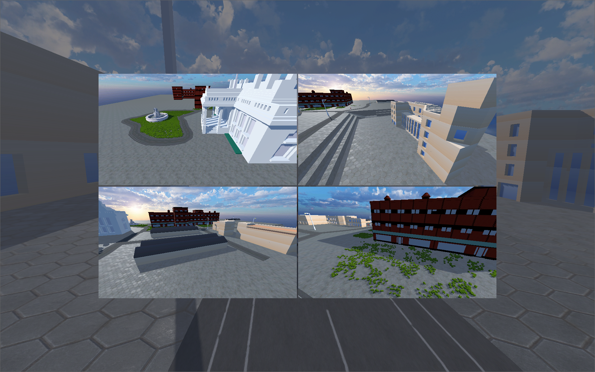
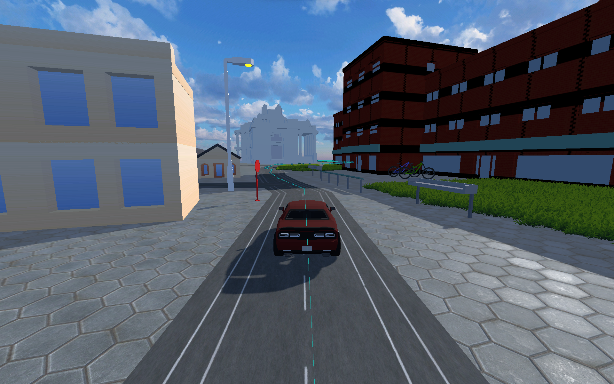

# Urban Labyrinth: Navigating Pulchowk Campus with A* Algorithm

<p align="center">
  
</p>

## Overview
Urban Labyrinth is a 3D simulation of the Pulchowk Campus, where a virtual vehicle navigates to designated parking locations using the A* pathfinding algorithm.

The primary goals of the project are to create an accurate 3D representation of the campus, implement the A* algorithm for optimal path planning, and demonstrate its practical application in a real-world scenario.


## Features

### Detailed 3D simulation of the Pulchowk Campus

<p align="center">
  <video src="https://github.com/bishal0602/UrbanLabyrinth/assets/106395844/645fef9f-9ffa-4bd8-b51b-3402dafd03c6" controls="controls" alt="Pulchowk Campus View" width="720"></video>
</p>

### Designated parking locations within the campus

<p align="center">
  
</p>

### Navigation using A* pathfinding algorithm

<p align="center">
  
</p>


## Usage

### For Windows users 
Simply download the exe file from the [releases](https://github.com/bishal0602/UrbanLabyrinth/releases/tag/v1.0.0) section.

<a href="https://github.com/bishal0602/UrbanLabyrinth/releases/download/v1.0.0/UrbanLabyrinth.exe" download>
  <button style="padding: 10px 10px; background-color: #74eb32; color: #001a44; border: none; cursor: pointer; border-radius: 5px; font-size:16px;font-weight:600">UrbanLabyrinth.exe</button>
</a>

### Building from Source

If you prefer to build the project from source, follow these instructions:

1. **Clone the repository:**
```
git clone https://github.com/bishal0602/UrbanLabyrinth.git
```

2. **Open the project in [Godot Engine](https://godotengine.org/).** 

3. **Build and run the project using Godot's built-in tools.**

## Contributors
- [@bhuwantechnical](https://github.com/bhuwantechnical)
- [@bishal0602](https://github.com/bishal0602)
- [@dthp3277](https://github.com/dthp3277)
